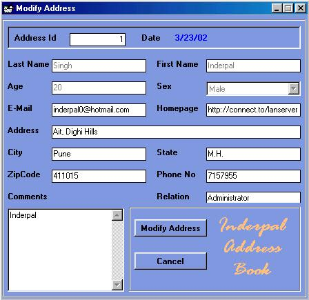



## AnyAddress

### Description

My Address Book(AnyAddress) allows you to add the persons name, email,Homepage ,Address, phone number and so many other fields. It also have good GUI. It is fully User friendly So u can easily use it.

I have used Microsoft Access as Database Sql for searching the records.
 
### More Info
 

             |
---                |---
**Submitted On**   |2002-03-25 00:48:02
**By**             |[inderpal](https://github.com/Planet-Source-Code/PSCIndex/blob/master/ByAuthor/inderpal.md)
**Level**          |Intermediate
**User Rating**    |5.0 (10 globes from 2 users)
**Compatibility**  |VB 5\.0, VB 6\.0
**Category**       |[Databases/ Data Access/ DAO/ ADO](https://github.com/Planet-Source-Code/PSCIndex/blob/master/ByCategory/databases-data-access-dao-ado__1-6.md)
**World**          |[Visual Basic](https://github.com/Planet-Source-Code/PSCIndex/blob/master/ByWorld/visual-basic.md)
**Archive File**   |[AnyAddress651243242002\.zip](https://github.com/Planet-Source-Code/inderpal-anyaddress__1-33038/archive/master.zip)

